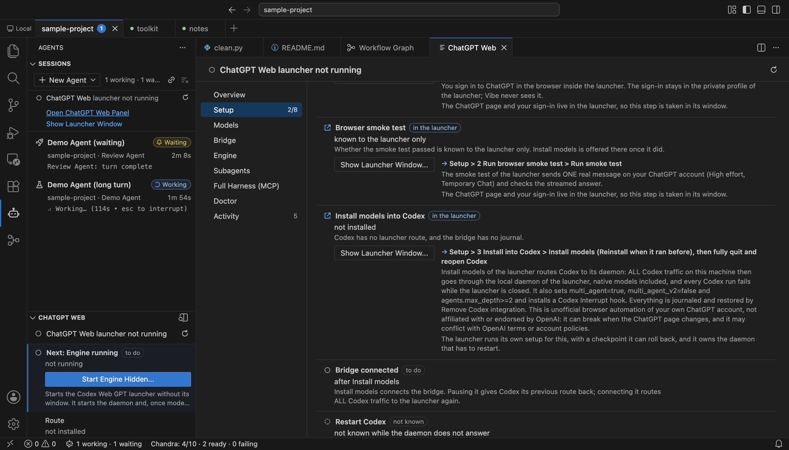
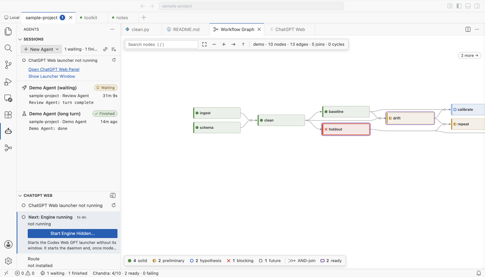

# Features

[Back to the start page](index.md)

Everything below is in the app as shipped. Each section ends with what is not true of it.

## Workspace bar

A full-width row under the title bar. Entries are grouped by host — `Local` first, then one group
per remote — and each entry is a folder or a `.code-workspace`. The tab of the window you are
looking at is drawn like an active editor tab; a dot marks a workspace whose window is open but
hidden, and dimmed text marks one that is pinned but closed.

Clicking a tab presents that window at the same position and hides the previous one, so several
workspaces share one frame. Hidden windows keep running: terminals, agents and SSH connections
continue.

- `+` opens a quick pick: Open Folder, Open Workspace from File, your SSH hosts, recent entries.
- Right-click a tab: pin, close the window, remove, copy path, reveal in Finder.
- `ctrl+cmd+]` / `ctrl+cmd+[` on macOS, `ctrl+shift+alt+]` / `[` elsewhere.
- `workbench.workspaceBar.visible` hides the bar; `window.singleFrame: false` turns the
  single-frame behaviour off and leaves the bar as a plain window switcher.

Not true of it: the bar is not part of F6 part navigation, and the Windows and Linux keybindings
have not been exercised by the authors.

## Workflow graph

For projects that keep [Chandra](https://github.com/FoAKTEE/Chandra) ledgers — append-only JSONL
files under `results/ledgers/` — the **Chandra** entry in the activity bar draws them as a directed
hypergraph. A node's dependencies form one hyperedge: several sources meet in a junction and one
arrow continues into the target. Cycles are drawn, not rejected.

- Search with `/`, focus a node to dim everything outside its reach, probe a route between two
  nodes, filter by status from the legend.
- The Nodes tree is the keyboard-friendly twin of the graph; selection is shared.
- The status bar shows solid / total, how many nodes are ready, how many are failing.
- Appending a row to a ledger updates the view without a reload.
- Opening the graph on a large project starts at a legible zoom centred on the ready nodes;
  the Fit button shows the whole graph.

Not true of it: without `results/ledgers/` the view has nothing to draw, and it will say so.

## Agents view

The **Agents** entry in the activity bar lists agent sessions, each a card with its state, elapsed
time and last output line: working, waiting for you, finished, or failed with its exit code.
Sessions start from a profile (`New Agent`) or are adopted automatically when you type a known
agent command in any terminal. Each workspace tab carries a badge, so an agent waiting in a window
you are not looking at — including one on a remote host — is visible from where you are.

State comes from the terminal stream itself: shell-integration marks and exit codes, the terminal
bell, desktop-notification escape sequences, and going quiet after output. No cooperation from the
agent is needed.

Configure your own with `vibeAgents.profiles`; `vibeAgents.notify` controls notifications.

Not true of it: in a shell that emits no shell-integration marks (a heavily customised zsh prompt,
for instance) there is no exit code — a failed run shows as finished — and hand-typed commands are
not adopted. Working-versus-waiting is a heuristic, not a report from the agent. Windows shells are
untested.

## ChatGPT Web panel

The interface of the Codex Web GPT launcher, inside the editor: a setup checklist, the bridge
connect/pause, engine start/show/quit, doctor, and an activity log. Steps that touch your ChatGPT
account — signing in, the smoke test, installing models — open the launcher's own window, because
that is where the ChatGPT page and your login live. Everything with a consequence is a click you
make, with the consequence written next to the button.

See [ChatGPT Web](chatgpt-web.md) for what it costs and what it changes on your machine.

Not true of it: the panel has never been driven against a live ChatGPT account by its authors.
Every state it shows was verified against stand-ins.

## Remote SSH

Hosts come from `~/.ssh/config`. See [Remote SSH](remote-ssh.md).

## What this fork is tested on

Built and used on macOS on Apple silicon. The Linux build is produced in a container and starts
there; it has not been used in a desktop session by its authors. There is no Windows build. None of
the builds are signed, and there is no auto-update.
