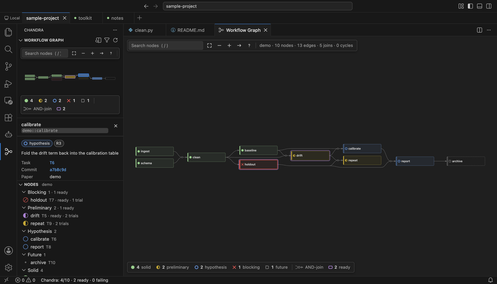
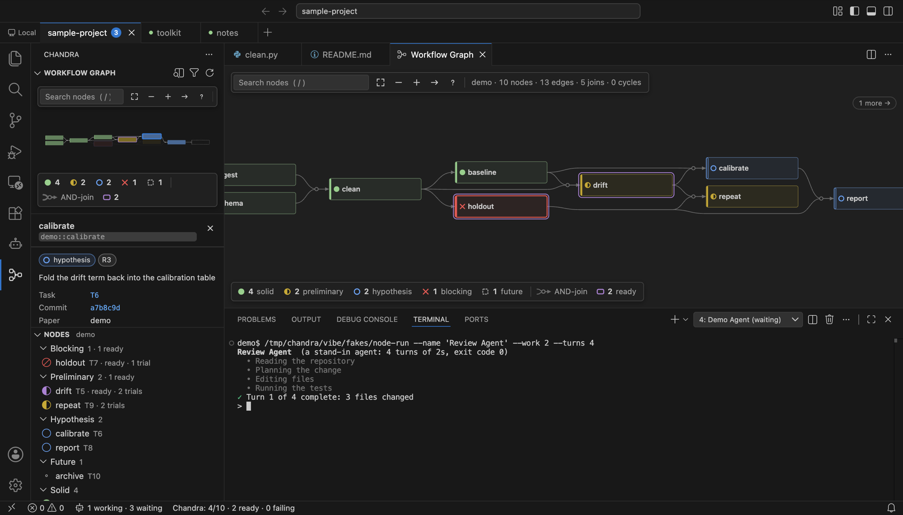

# Vibe Slop Code

A patch-level fork of [VS Code](https://github.com/microsoft/vscode) (Code - OSS, pinned at
1.129.1). Upstream is never vendored: this repository tracks one patch per changed upstream file
plus the new files, and a script rebuilds the fork from a clean checkout.

It adds five things.

**Workspace bar.** A row under the title bar holding every host and workspace in one frame,
grouped by host. Switching swaps windows in place; the hidden ones keep their terminals, agents
and remote connections running. `ctrl+cmd+]` and `ctrl+cmd+[` cycle through them.

**Workflow graph.** A built-in view that folds a [Chandra](https://github.com/FoAKTEE/Chandra)
project's append-only ledgers into a directed hypergraph: joins drawn as one junction, cycles as
loop-backs, focus and route probing, live updates as rows are appended.



**SSH hosts from `~/.ssh/config`.** The `+` menu lists your hosts. The first connect uploads a
matching `vibe-server` over the SSH connection; `~/.vscode-server` is never touched.

**Agents view.** Coding agents run in ordinary integrated terminals; the view shows which one is
working, which is waiting for you, and which has finished or failed — including agents in windows
you are not looking at.



**ChatGPT Web panel.** The interface of the third-party Codex Web GPT launcher, inside the editor.
You install and sign into that launcher yourself; this fork never sees the login.

---

## Download

Builds are unsigned. Read [Install](install.md) before running them — macOS will refuse the app
until you clear its quarantine flag.

| Platform | File |
|---|---|
| macOS, Apple silicon | [VibeSlopCode-darwin-arm64-1.129.1.zip](https://github.com/FoAKTEE/Vibe-Slop-Code/releases/latest/download/VibeSlopCode-darwin-arm64-1.129.1.zip) |
| Linux x64 | [VibeSlopCode-linux-x64-1.129.1.tar.gz](https://github.com/FoAKTEE/Vibe-Slop-Code/releases/latest/download/VibeSlopCode-linux-x64-1.129.1.tar.gz) |
| Remote server (linux-x64 hosts) | [vibe-server-linux-x64…tar.gz](https://github.com/FoAKTEE/Vibe-Slop-Code/releases/latest) |
| Checksums | [SHA256SUMS](https://github.com/FoAKTEE/Vibe-Slop-Code/releases/latest/download/SHA256SUMS) |

All files, with their notes, are on the
[releases page](https://github.com/FoAKTEE/Vibe-Slop-Code/releases).

There is no Intel-Mac build and no Windows build. There is no auto-update: to move to a newer
version, download it and replace the app.

## Read on

- [Install](install.md) — per platform, the `vibe` command, uninstalling.
- [Features](features.md) — what each feature does and where its limits are.
- [Remote SSH](remote-ssh.md) — how hosts and the server work.
- [ChatGPT Web](chatgpt-web.md) — what the panel drives, and what it costs.
- [Licences](licences.md) — this fork, upstream, and the vendored parts.

## Build it yourself

```sh
git clone https://github.com/FoAKTEE/Vibe-Slop-Code.git
cd Vibe-Slop-Code
scripts/bootstrap.sh          # pinned Node, upstream checkout at the pin, patches, npm ci
scripts/build.sh              # compile
scripts/run.sh                # run the dev build
scripts/package.sh            # a macOS app next to the checkout
scripts/package-linux.sh      # a Linux x64 tarball (needs Docker)
scripts/build-server.sh       # the remote server for linux-x64 hosts (needs Docker)
```

Tested on macOS on Apple silicon. `scripts/verify-package.sh`, `scripts/verify-linux.sh` and
`scripts/verify-server.sh` check a build before you ship it.
